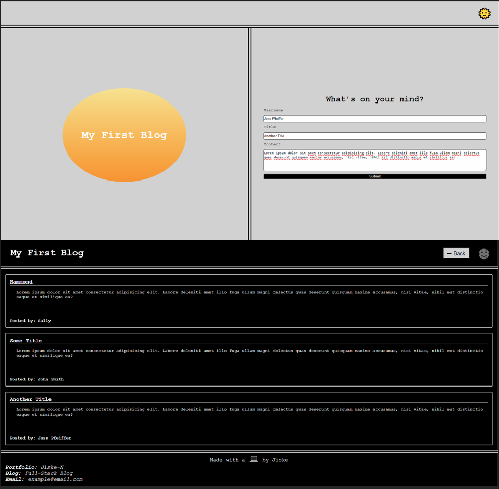

# My First Blog

## Link & Contents
- [The Deployed Page](https://jiske-n.github.io/my-blog/)
- [Further Goals](#further-goals)
- [Potential Issues/Improvements](#potential-issuesimprovements)
- [Key Learnings](#key-learnings)
- [Contributing and Feedback](#contributing-and-feedback)
- [Credits](#credits)
- [Licence](#licence)

## The Project

This page was designed for a user to be able to input information and then be redirected to another page showing the information in the form of a blog post. They then have the ability to relocate back to the form page and enter another post which will then appear below existing posts on local storage. 

Other features include:
- A light/dark mode toggle which also persists between pages.
- Links to external pages and email.

Goals included, making sure as many elements as possible included semantic tags and user friendly descriptions.

- [The Deployed Page](https://jiske-n.github.io/my-blog/)

## Further Goals

Other goals include:
-Writing a good README.
-Ensuring commenting is folowing best practices and in place for ease of future alteration.
-Have all elements of the page working without errors.

## Potential Issues/Improvements

- Adding media queries to adjust form screen so that on smaller devices the right element appears below the left.
- Condensing some of the code.
- Unsure if the balance for commenting is about right or too sparse/many.
- Trying to convert code to be uniform and follow best practice

## Key Learnings

The biggest learning points and hurdles I faced revolved around working out how different elements linked together.

Other learnings include:
- One way of implementing light and dark mode/different themes.
- Refresher on flexboxes.
- Hopefully, improved commenting.
- Practicing usage of localstorage and functions.

## Contributing and Feedback

If you find any issues or have contributions or feedback you can do so by opening an [issue](https://github.com/Jiske-N/my-blog/issues) on Github.

## Credits

Mockup provided by edX/Monash University

## Licence

None presently. 
